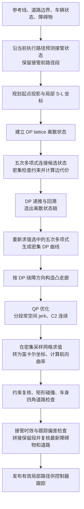

# DP＋QP 局部路径规划设计

本文对应当前 `DPQPPathPlanner` 的实际实现，说明一帧局部路径从车辆状态到控制器输入的完整过程。算法选择、基线对比和其他模块见 [ALGORITHMS.md](ALGORITHMS.md)。算法选择位于 `config/default.yaml`，DP+QP 与接管调参位于 `config/algorithms.yaml`，完整说明见[配置说明](../config/README.md)。

## 处理顺序与模块职责



五次多项式在 **DP 搜索阶段就参与候选边构造、可行性检查和代价计算**。DP 回溯后，再对选中的多项式求值，形成 QP 的参考曲线和走廊依据。QP 本身承担平滑优化；QP 输出后没有额外的几何平滑步骤。

| 文件 / 入口 | 职责 |
| --- | --- |
| `engine/ros_nodes/planner_node.py` | ROS 输入输出及算法选择 |
| `engine/algorithms/planner/motion_planner.py` | 异步规划请求、车辆状态快照及结果处理 |
| `engine/algorithms/planner/handover.py::PathHandover` | 接管状态预测、保留段、时效和跟踪偏差检查 |
| `engine/reference_line/dp_qp_planner.py::DPQPPathPlanner._plan` | 坐标转换、格点构造、走廊、算法串联及输出验证 |
| `engine/algorithms/planner/dp_qp.py::DP_algorithm` | 格点状态图上的动态规划搜索 |
| 同文件 `quintic_edge` | 五次多项式及其一、二阶空间导数求值 |
| 同文件 `Quadratic_planning` | 稀疏约束 QP 构造与 OSQP 求解 |
| `engine/reference_line/route_aware_planner.py::CorridorMotionPlanner` | 公共道路边界与矩形碰撞检查 |

## 1. 输入与局部坐标

输入包括参考线 `(x, y, heading, curvature)`、可行驶左右边界、实际车辆位置与状态，以及障碍物矩形 `(x, y, length, width, speed, heading)`。当前算法将障碍物视为静态矩形，未使用输入中的障碍物速度做预测。

首次规划采用实际车辆状态；已有有效执行路径时，ROS 节点采用下节所述的未来接管状态。`_plan` 将传入的规划位置投影到参考线，不使用 `pred_loc` 作为起点。提取局部参考线，用几何距离累加得到实际弧长 `s`，起点设为 `s=0`；`s` 的单位是米，不是参考线点索引。规划范围受 `horizon_points` 限制，并非固定米数；闭环参考线支持跨接缝提取。直接调用 `_plan` 不自动执行 ROS 接管逻辑。

### 异步重规划的接管策略

规划请求定时周期默认 0.05 s（20 Hz），结果轮询周期默认 0.02 s；有请求尚未完成/发布时跳过新请求，实际更新频率可能更低。两个定时器和接管判断都采用仿真时钟。

已有执行路径时，先把实际车辆投影到当前路径，以实际速度、加速度和方向误差估算沿路径的前进距离。预测时间取近期实测请求到结果轮询的延迟加余量，并限制在 `[handover_min_time_s, handover_max_time_s]`，默认 `[0.15, 0.4] s`，余量默认 0.05 s。延迟变大时立即上调估计，变小时缓慢衰减。

接管点向前取当前路径的已有采样点，以完整保留接管前的路径点。预测状态的位置、切向方向与曲率取该点，速度用实际速度/加速度外推；这是一种受跟踪误差限制的**名义沿路径预测**，不是包含执行器与控制闭环的完整车辆动力学滚动预测。请求前及结果接入前检查实际位置、速度方向、运动曲率与当前路径的一致性，默认容差分别为 0.35 m、0.25 rad、0.12 1/m。几何拼接采用更严格的方向 0.03 rad、曲率 0.02 1/m 容差，同时不超过用户配置的跟踪容差。

计算期间继续跟踪当前路径。新尾段的 QP 起始条件由接管点状态转换得到，匹配位置、方向与曲率；前段仍使用原路径点。接管后的软连续性目标随距离衰减，允许新路径逐渐偏离旧路径。由于消息为离散几何点，拼接方向和曲率仍做容差检查，不声称笛卡尔输出严格 C2 连续。

结果轮询时若超过预测截止时间、实际车辆已经驶过接管点，或跟踪/拼接偏差超限，则拒绝新尾段。拼接成功后还要按**最新收到**的障碍物和道路边界复核整条候选路径，保留段同样参与检查。

被拒绝的结果不更新上一帧连续性目标。仅当旧路径未超过原接受时间 0.5 s、剩余距离足够、车辆仍跟踪一致且最新安全检查通过时，才短时重发旧路径；重发不刷新其接受年龄。否则发布空路径停车。DP/QP 求解失败仍直接发布空路径，不应用旧路径回退。场景/路线重置会清空路径、接管状态和延迟估计。

转向执行器的瞬态可能使名义预测的跟踪容差失效。此时不强行接入名义未来尾段：只有位置/方向偏差未超过对应跟踪容差的两倍、旧路径年龄及剩余距离满足限制、旧路径与**实际车身**均通过最新道路/碰撞检查时，才允许短时继续旧路径，同时从实测状态重新规划，并清除旧软连续性目标。恢复时曲率由实测状态重新作为规划边界条件，不要求仍与旧路径曲率相符。这是恢复模式，不声称继续满足未来接管点的衔接保证；连续三次请求的位置、方向、曲率误差均进入正常容差的一半以内后，才重新启用名义接管预测，避免模式反复切换。该处理减少反复制动/恢复打断延迟控制器历史的情况，仍受原路径接受年龄上限约束；恢复规划不可行时仍停车。

横向状态记为：

```text
l   = 相对参考线的横向偏移
dl  = dl/ds
ddl = d²l/ds²
```

起始 `l0` 来自规划起点位置的法向投影。异步规划携带首次实际状态或未来接管状态的 `(phi, vx, vy, yaw_rate)` 快照，用速度方向相对参考线的偏差、参考线曲率及车辆曲率估计起始 `dl0`、`ddl0`。直接调用 `_plan` 且没有状态快照时，两项默认置零。较大起始方向偏差会被拒绝。

障碍物也投影到局部 S-L 坐标，用航向与长宽计算纵、横向占用范围；局部参考线端点外的纵向残差保留，避免把远处障碍物错误夹到规划端点。道路边界由地图边界投影并扣除配置的走廊余量得到；缺少地图边界时按名义车道宽度推导。

## 2. DP lattice 状态采样

纵向列采用 `adaptive_dp_knots`：默认远端最大间隔为 `dp_station_step_m=8 m`；列起点位于前 12 m 或距障碍物纵向中心小于 12 m 时，间隔缩小至不超过 4 m。若配置更小，沿用更小值；最后一列截断到局部规划终点。

每列在可行驶横向范围内按 `dp_lateral_step_m=0.5 m` 采样，并补充上边界、目标偏移、当前偏移、障碍物两侧安全偏移及从当前偏移延伸的候选位置，最后裁剪并去重。因此横向候选并非严格等间距。

普通节点状态为 `(l, dl, ddl)`：`dl` 取 `{-0.2, 0, 0.2}`，`ddl=0`。第一列只有传入的起始状态；终点列只取 `dl=0`，但横向位置仍参与搜索，没有强制回到 `l=0`。

目标偏移由目标车道相对参考车道的位置计算，无有效目标车道时为零。这是软偏好，实际搜索覆盖可行驶横向范围。

## 3. 五次多项式构造候选边

相邻两列的候选状态通过五次多项式连接。以段内弧长 `u` 表示：

```text
l(u) = a0 + a1*u + a2*u² + a3*u³ + a4*u⁴ + a5*u⁵
```

六个系数满足两端的 `l、dl、ddl` 六个边界条件。实现采用归一化弧长计算，以改善数值尺度。

先排除端点不安全及横向位移超过斜率上限允许范围的状态对，再批量计算剩余连接。每段以不超过 `min(0.5, local_path_sampling_resolution_m)` 米的弧长间距求值，包含两端点；默认 4 m 段有 9 个检查点，8 m 段有 17 个检查点。

候选边检查包括：

- `|dl| <= tan(0.35)`。
- 道路边界以及障碍物占用收紧后的横向范围。
- 沿车身前后方向取五个位置，以 `l + offset*dl` 近似各位置的横向偏移并检查对应边界。

这里没有对 `ddl` 施加与 QP 相同的硬上限。DP 边代价为段长乘以采样平均代价：`(l-preferred)² + 20*dl² + 100*ddl²`，另加靠近障碍物的软余量代价。

五次多项式具有匹配端点导数的作用，但当前 DP 代价没有直接包含三阶导数平方项，不能据此宣称整条路径的 jerk 全局最小。

## 4. DP 递推和回溯

每个状态保留最低累计代价及其父节点：

```text
C(B) = min_A [ C(A) + cost(A -> B) ]
```

不安全连接的代价为无穷大，不可达状态被移除。终点列选择最低代价状态，再沿父节点回溯得到 `(l, dl, ddl)` 状态链。这是在当前有限格点图上的最优解，不是连续空间的全局最优解，也不代表完整可行解空间。

此时已经确定一条由五次多项式边组成的粗路径及其绕障方向；尚未得到最终 QP 路径。

## 5. 密集 DP 曲线与凸走廊

在整个局部弧长范围建立统一密集网格，最大间距为 `min(0.5, local_path_sampling_resolution_m)` 米。对回溯选中的五次多项式重新求值，得到 `dp_l(s)`；这一步沿用原多项式，不是另做一轮平滑。

根据 `dp_l(s)` 相对各障碍物的位置选择绕行侧，在道路范围内收紧横向上下界，形成 QP 的凸约束。五个车身位置分别考虑纵向占用，不把整个前后车身余量统一施加到所有位置。

QP 固定这次 DP 提供的绕障侧别，不能在求解中重新选择障碍物另一侧。如果上下界交叉，直接判定走廊不可行。

上一帧已接受曲线按全局参考线弧长重新对齐；在重叠范围内，优化目标采用 `(当前 DP 偏移 + w*上一帧偏移)/(1+w)`，其中 `w=5*exp(-s/12)`，其他位置沿用当前 DP 偏移。这使接管附近较强地保持连续性，远端允许新规划调整。这仅是减轻帧间变化的软目标，当前硬约束仍需满足。

## 6. QP 优化与平滑

QP 使用自己的节点网格：默认起点前 12 m 最大间隔 0.5 m，障碍物纵向中心附近 12 m 最大间隔 1 m，远端最大间隔由 `qp_station_step_m=4 m` 控制。自适应判断按每段起点执行，区间长度同时受配置上限约束。

每个 QP 节点显式保留 `l、dl、ddl`，每个区间保留一个常量空间 jerk `j=d³l/ds³`。若有 `n` 个节点，共有 `4n-1` 个变量。相邻节点满足精确积分等式：

```text
l_next   = l   + h*dl + h²/2*ddl + h³/6*j
dl_next  = dl  + h*ddl + h²/2*j
ddl_next = ddl + h*j
```

因此 QP 曲线每段是三次多项式，节点间 `l、dl、ddl` 连续，即 S-L 表达下的 C2 连续；空间 jerk 允许在节点处跳变。它与 DP 的分段五次多项式属于不同曲线族。

目标函数惩罚与目标曲线、目标偏移的偏离，以及一阶、二阶导数和空间 jerk。当前权重分别为 `10、0.1、20、100、10`，jerk 项按区间长度加权。约束包括：

- 起始 `l0、dl0、ddl0` 固定及节点间精确积分关系。
- 密集采样位置的凸走廊、斜率和车身近似约束。
- 二阶空间导数范围 `|ddl| <= max(0.08, |ddl0|+0.005)`，允许较大初始状态逐渐恢复。

OSQP 使用 CPU `builtin` 后端，从目标曲线插值生成初值；默认求解时间限制为 `qp_time_limit_s=0.08 s`，迭代上限 4000。该时间限制属于 QP 求解器，不是整帧 DP＋QP 的总耗时限制。只接受有限数值的 `solved` 或 `solved inaccurate` 结果，并独立检查全部约束残差是否在 `1e-5` 容差内。

**DP 可行不保证 QP 可行**：两者曲线族不同，QP 又增加二阶导数约束，DP 路径也不能直接作为满足所有 QP 等式的解。

## 7. 输出求值与最终验证

QP 的分段多项式在第 5 步建立的密集网格上解析求值，得到优化后的 `l、dl、ddl`。按参考线法向转换为笛卡尔坐标：

```text
x = x_ref - l*sin(theta_ref)
y = y_ref + l*cos(theta_ref)
```

常规输出由笛卡尔点计算航向和曲率。对于名义接管尾段，**首端点**使用 QP 的解析导数与参考线曲率计算，避免首段离散差分改变接管点边界状态。记参考线曲率为 `kr`、其弧长导数为 `kr_prime`，`f=1-kr*l`：

```text
heading   = theta_ref + atan2(dl, f)
curvature = [f*ddl + kr*(f²+2*dl²) + kr_prime*l*dl] / (f²+dl²)^(3/2)
```

名义接管状态的起始二阶导数由该曲率关系反解，使起点航向、曲率与输入状态一致。参考线曲率导数由局部网格差分估计。参考线坐标为分段线性插值，与存储曲率并非严格一致，因此不对整个输出套用解析曲率；其余点仍按实际笛卡尔几何计算。首次/实际状态恢复规划沿用原有起始导数估计和几何输出方式。

随后执行公共 S-L 约束检查、完整有向矩形的 SAT 碰撞检查，并将车身四角投影回参考线，检查是否超出物理道路边界。只有全部通过，才返回 `(x, y, heading, curvature)` 路径。ROS 接管层只有在后续时效、拼接及最新安全检查通过后，才将该曲线作为下一帧软目标；拒绝时恢复原已接受曲线。

这一阶段没有额外平滑操作，避免后处理改变已求解的曲线及约束。S-L 曲线的 C2 连续性也不等于离散参考线插值与坐标转换后具有同等级别的严格几何连续性保证。

## 三套网格及参数

| 网格 | 用途 | 默认间距 |
| --- | --- | --- |
| DP lattice 纵向列 | 离散状态搜索 | 起点/障碍物附近不超过 4 m，远端不超过 8 m |
| DP 边检查点及全局密集网格 | 边检查、DP 曲线求值、走廊与 QP 输出求值 | 不超过 0.5 m |
| QP 节点 | 分段空间 jerk 优化变量 | 起点不超过 0.5 m、障碍物附近 1 m、远端 4 m |

DP 的横向采样另由 `dp_lateral_step_m` 控制，默认 0.5 m，并有补充候选。`local_path_sampling_resolution_m` 小于 0.5 时会进一步增密；大于 0.5 时正式 DP＋QP 仍保留 0.5 m 上限。这些密集间距沿**参考线弧长**计算，不是最终绕障曲线自身弧长。

## 失败处理与适用范围

`last_status` 记录 `invalid_reference`、`unsupported_start_heading`、`dp_infeasible`、`corridor_infeasible`、`qp_failed`、`validation_failed`、`body_outside_road` 或 `solved`。`last_qp_diagnostics` 提供求解器状态、迭代数、耗时和变量数。

算法求解失败返回空路径，由现有安全监督与控制链处理停车；不会自动切换 `baseline`，也不会发布未经当前约束验证的旧路径或走廊中线。接管层对结果拒绝与短时旧路径复用另按前述策略处理。

当前实现是依托参考线和道路边界的横向几何规划，不含动态障碍物预测、纵向 ST 优化或完整无结构道路导航。这里的 jerk 对弧长求导，不是时间 jerk；变速行驶时二者不同。密集采样、车身线性近似及最终矩形检查用于工程验证，不能视为连续空间的形式化安全证明。

## 验证范围

`tests/test_planner_handover.py` 覆盖接管预测、保留段、过期和偏差拒绝、复用年龄、恢复滞回、最新障碍物/道路检查、曲线起始方向与曲率保持，以及场景 2 延迟 100 ms 接管的闭环绕障。ROS 环境下还运行独立 launch 场景 2，检查到达终点、无碰撞、无越界和有效规划后的空路径数量。

`figure_eight + assumed` 的控制命令历史失配已通过状态消息携带真实执行器队列、停车期间持续同步修复，接口与处理规则见 [ROS2.md](ROS2.md)。反复停车的主要诱因还包括 LQR 离散模型仅按距离细分、遗漏仿真端 0.0025 s 最大积分子步：6 m/s、50 ms 控制周期下，原模型积分一次而实际车辆积分二十次，造成反馈与执行器补偿失配。实际跟踪速度方向偏差曾达到约 22.5°，超过 DP 的 20°/斜率 0.365 约束，制动后残余航向又使后续 DP 无解。

修正后 LQR/MPC 均从场景上下文同步最大积分子步，未放宽 DP 约束。2026-10-01 独立 ROS 进程的 `figure_eight + assumed` 验收连续运行 30 s，行驶约 192 m，启动 2 s 后最低速度约 4.33 m/s，没有停车、碰撞或驶出道路。回归同时检验不同速度、控制周期、执行器延迟与最大子步下的模型矩阵是否匹配实际车辆转移；场景验收增加持续行驶检查。该结果限定于当前测试场景和假设执行器参数。
