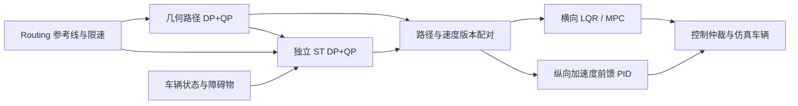

# 独立纵向速度规划（第一版）

## 模块边界

几何路径规划输出 `x(s), y(s), θ(s), κ(s)`，不分配时间和速度；速度规划消费已经确定的几何路径，独立输出 `s(t), v(t), a(t), jerk(t)`。控制端将两者组合成带时间的轨迹，横向 LQR/MPC 跟踪路径，纵向加速度前馈 PID 跟踪速度。速度规划不修改横向避障策略或路径坐标。



第一版覆盖定速、曲率减速、静态障碍停车、真实终点停车及障碍移除后的恢复起步。路径已绕开障碍时，不因为障碍存在于路线上而再次停车。沿当前路径发生的移动障碍冲突输出无效参考并制动；复杂动态交互及让行决策留待后续。

## 求解流程

1. 拷贝本次运行的几何路径、实际车辆状态、障碍物和上下文。按航向将车辆投影到路径，得到本次速度轨迹的绝对起始弧长 `origin_s`；轨迹中的 `s` 是相对该起点的行驶距离，单位 m。
2. 沿路径以 0.25 m 的间隔检查曲率及矩形车体碰撞。曲率限速为 `sqrt(max_lateral_accel / abs(κ))`，并与场景目标速度、投影到局部路径的路段限速取最小值。路段限速只乘一次场景速度比例。
3. 静态障碍采用包含航向的 SAT 矩形碰撞检测，以实际车长、车宽建立禁止进入的 ST 区域。额外覆盖半个采样间隔，并在首次碰撞位置前预留 `stop_gap_m`。真实任务终点落入局部路径时加入停车上界；闭环路线不加入终点停车约束。
4. ST 时间格点默认间隔 0.2 s，最大时域 6 s。无停车边界且局部路径不足时缩短时域；局部截断点只约束可用几何范围，不设置终端零速度。DP 以七档 jerk 加四个自适应边界动作扩展 `(s,v,a)`：到达加减速度边界、零加速度和两步平稳停车。每层保留不同状态，默认 beam width 为 96；必须保留最快制动候选，低速区进一步细分状态，防止离散量化丢失停车解。
5. DP 对未来低限速反向传播制动引导包络，提前保留减速候选。已经超过新限速时采用可实现的 jerk 制动恢复包络，不能要求瞬间降低初始速度；障碍物位置上界仍为硬约束。
6. QP 优化所有时间节点的 `s,v,a` 和区间 jerk。固定实际初始状态，使用常 jerk 的精确积分等式：

   ```text
   a_next = a + jerk * dt
   v_next = v + a * dt + jerk * dt² / 2
   s_next = s + v * dt + a * dt² / 2 + jerk * dt³ / 6
   ```

   约束包含非负速度、可用路径范围、停车位置、实际车辆能力、舒适加减速度和 jerk；时域内要求停车时约束终端速度与加速度为零。实际初始加速度超出舒适范围时保留初始值，以有限 jerk 在格点上恢复，不能直接裁剪成另一个初始状态。
7. QP 使用凸 ST 可行范围与保守空间限速：时间节点的位置下界为零，不能用 DP 时间位置减去固定余量作为下界而强迫 QP 保持过快进度；非停车时位置上界使用 DP 进度加 2 m，停车时为物理停车上界。速度上限取相邻区间可能覆盖的空间范围内的最低路段/曲率限速，再叠加初始超速恢复包络。需要时最多进行四次限速修正。DP 的预减速包络用于搜索引导，不冻结 QP 的停车到达时刻。检查等式/不等式残差、每段内部采样及速度极值；只有经过验证的结果标记 `valid=true`。

## ROS 接口与接管

独立节点 `speed_planner_node` 默认以 0.1 s 周期提交规划，0.02 s 轮询结果。只有一个求解工作线程，忙时跳过提交，避免旧请求排队。实际结果频率受计算耗时和仿真时钟影响。

标准配置把几何路径的最小预测接管时间从原单阶段的 0.15 s 调整到 0.3 s，覆盖几何规划之后新增的 ST 提交等待、求解和结果轮询。不能只按几何求解耗时选择拼接点，否则速度配对完成时车辆可能已经驶过该点。几何模块独立使用时仍保留原来的缺省接口。

输入为 `planned_path`、`vehicle/state`、`obstacles`、`sim/context` 和 `routing/reference_line`。输出为 `speed_profile`（`SpeedProfile`）和 `speed/diagnostics`；控制端额外输出 `speed/tracking`。

`SpeedProfile` 携带 `run_id`、`path_sequence`、`origin_s`、状态及速度节点。其 `header.stamp` 是规划初始车辆状态的时间，不能改成计算结束时间。每个 `SpeedPoint` 包含相对时间、相对弧长、速度、加速度和后续区间 jerk，均为 SI 单位。

控制端暂存最新 16 个几何候选与待配对速度结果，按精确 `path_sequence` 激活整对数据。新几何候选到达时继续执行尚未过期的上一对轨迹；不能立即换路径后继续使用旧路径的速度。DDS 先收到速度时等待匹配路径。空路径立即撤销参考，禁止旧结果恢复运行。

每个实际车辆状态通过 `state.timestamp - profile.header.stamp` 计算执行进度，使用同一常 jerk 积分式得到速度和前馈加速度，因此计算期间车辆的运动不会被当作轨迹起点重置。结果接收年龄上限默认 0.4 s；控制参考年龄及安全心跳上限默认 0.6 s。

新求解失败或晚到时，只能复用起始年龄不超过 `reference_reuse_s=0.6 s` 的上一份已验证速度参考，且障碍物的完整签名必须未变化、车辆及障碍物观测新鲜、当前速度与该参考差不超过 1.5 m/s。复用保留原始时间戳及路径版本，不延长寿命；路径为空、移动冲突、障碍物变化或观测过期不得沿用。没有满足条件的参考时制动。诊断状态以 `reused:` 标记复用原因。

该接管方式保留时间正确性与初始实测状态，第一版尚未增加纵向旧轨迹的固定前缀拼接。速度差超过 1.5 m/s 的结果拒绝激活；横向几何仍使用已有路径预测接管机制。

## 控制与停车

纵向控制为 `a_command = a_reference + PID(v_reference - v_measured) - coupling_compensation`。前馈模式的 D 项比较参考加速度与测量速度变化率，避免目标速度变化造成微分冲击；输出仍受实际加减速度及控制器 jerk 约束，饱和时清除继续推动饱和的积分。

标准配置的 PID 加速度变化率上限为 6 m/s³，高于 ST 参考的 3 m/s³ 以保留误差修正能力。异步求解、发布及控制仲裁带来执行延迟，过高的变化率会让实际加速度和下一次规划初始加速度互相放大，产生加减速振荡。正常 PID 输出即使达到满制动也保留微分和加速度历史，不能按保护停车清零，否则下一步 jerk 限制会从零重新起算。保护停车仍直接发布制动并清除 PID 历史，不受正常控制的变化率限制。

低速、零速度参考且不再要求加速时保持制动；恢复起步参考具有正加速度时允许输出油门，不能只按参考速度接近零而阻止起步。安全制动时清除 PID 历史，实际转向执行器历史仍按原机制同步。

前向场景默认终点完成速度阈值为 0.15 m/s，防止车辆高速经过位置容差就提前结束仿真。倒车泊车继续由泊车模块独立规划控制，安全监督不要求巡航速度参考。

## 配置与验证

速度求解参数位于 `config/algorithms.yaml` 的 `/**/speed_planner_node`，调度、时效和使能位于 `config/system.yaml`。标准 launch 默认启动速度节点并启用独立速度规划。单独实例化控制器时保持旧接口缺省行为；关闭 `speed_planning_enabled` 做对比时，需要同步关闭安全节点的 `require_speed_plan`。

新增消息后须重建接口及其消费者：

```bash
colcon build --packages-select lightweight_sim_msgs lightweight_sim parking_module
source install/setup.bash
ros2 launch lightweight_sim lightweight_sim.launch.py gui:=true
```

核心测试见 `tests/test_st_speed.py`，ROS 配对、监督及实际启动图测试见 `tests/test_speed_ros.py`。
